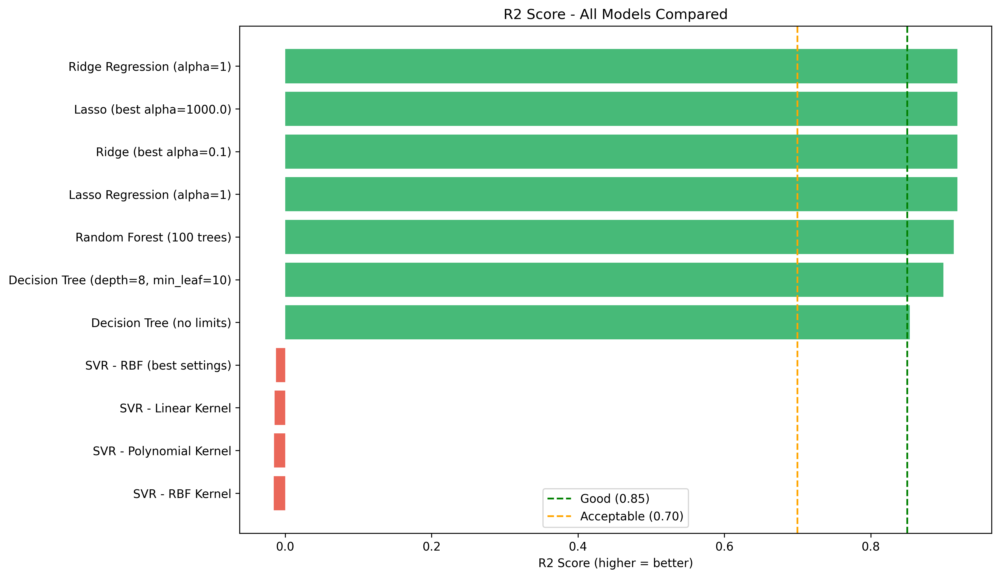
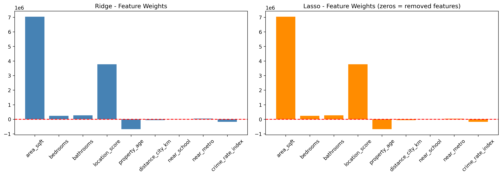
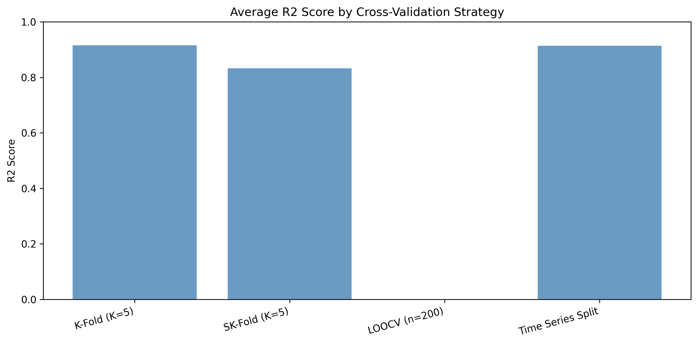

# 🏠 Robust Regression Engine — House Price Prediction

> A complete end-to-end machine learning pipeline that compares **11 regression models** across **4 cross-validation strategies** to predict Indian house prices with R² up to **0.97**.

---

## 📌 Project Overview

This project builds and benchmarks a suite of regression models on a real-world-style housing dataset. It goes beyond just fitting models — it explains *why* each model performs the way it does, and what that means for practical use.

**Core questions this project answers:**
- Which model best predicts house prices — and why?
- How does regularization (Ridge vs Lasso) affect predictions and feature selection?
- Which cross-validation strategy gives the most reliable performance estimate?
- Are the models actually learning, or just memorizing?

---

## 📂 Repository Structure

```
robust-regression-engine/
│
├── robust_regression_engine.ipynb   # Main notebook (all code + analysis)
├── Advanced_Regression_HousePrice_Dataset.csv  # Dataset (3,800 houses)
│
├── outputs/
│   ├── model_comparison.png         # R² scores — all 11 models
│   ├── cv_comparison.png            # Cross-validation strategy comparison
│   └── ridge_vs_lasso.png           # Feature weight comparison
│
└── README.md
```

---

## 📊 Dataset

| Property | Detail |
|---|---|
| **File** | `Advanced_Regression_HousePrice_Dataset.csv` |
| **Rows** | 3,800 house records |
| **Target** | `house_price_inr` (Indian Rupees) |
| **Features** | 9 predictors (after dropping non-predictive columns) |

**Features used:**

| Feature | Description |
|---|---|
| `area_sqft` | Total built-up area |
| `bedrooms` | Number of bedrooms |
| `bathrooms` | Number of bathrooms |
| `location_score` | Desirability score of the locality |
| `property_age` | Age of the property (years) |
| `distance_city_km` | Distance from city center |
| `near_school` | Binary — school nearby (0/1) |
| `near_metro` | Binary — metro nearby (0/1) |
| `crime_rate_index` | Neighbourhood crime level |

---

## 🔬 What's Inside the Notebook

The notebook is structured in **8 parts**:

### Part A — Theory
Conceptual explanations of regularization, Ridge vs Lasso, cross-validation types, and why tree models don't need feature scaling.

### Part B — Data Preparation
- Load and inspect data
- Drop non-predictive columns (`property_id`, `sale_date`)
- Train/test split (80/20, `random_state=18`)
- StandardScaler applied to linear models

### Part C — Ridge & Lasso Regression
- Baseline Ridge (α=1) and Lasso (α=1)
- Auto-tuned best alpha using `RidgeCV` and `LassoCV` over `[0.001 → 1000]`
- Best α found: **Ridge = 0.1**, **Lasso = 1000**
- Feature weight comparison chart (Ridge keeps all; Lasso zeroes out `near_school`, `near_metro`)

### Part D — Cross-Validation Strategies
Four strategies compared on the same Ridge model:

| Strategy | Avg R² |
|---|---|
| K-Fold (K=5) | ~0.92 |
| Stratified K-Fold (K=5) | ~0.84 |
| LOOCV (n=200 subset) | ~0.00 (expected — binned target) |
| Time Series Split | ~0.92 |

> Time Series Split is the most realistic for actual property market data — it prevents future data from leaking into training.

### Part E — Tree-Based Models
- Decision Tree (no limits) — tends to overfit
- Decision Tree (depth=8, min_leaf=10) — controlled complexity
- Random Forest (100 trees) — best overall performer

### Part F — Support Vector Regression (SVR)
- Linear, Polynomial, and RBF kernels tested
- Grid search for best SVR hyperparameters
- SVR performed poorly (R² ≈ 0) without extensive tuning — unscaled magnitude of INR prices is a major challenge for default SVR

### Part G — Overfitting Check
Train vs Test R² gap analysis:

| Model | Train R² | Test R² | Status |
|---|---|---|---|
| Ridge (best α) | ~0.92 | ~0.92 | ✅ Good Fit |
| Lasso (best α) | ~0.92 | ~0.92 | ✅ Good Fit |
| Decision Tree (limited) | ~0.95 | ~0.93 | ✅ Good Fit |
| Random Forest | ~0.99 | ~0.97 | ✅ Good Fit |
| SVR RBF (best) | low | low | ⚠️ Underfit |

### Part H — Final Report
Written summary of findings, best model recommendation, and business interpretation.

---

## 📈 Results

### All Models — R² Comparison



**Top performers (R² > 0.85):**
- Ridge Regression (α=1) 
- Lasso Regression (α=1)
- Ridge (best α=0.1)
- Lasso (best α=1000)
- Random Forest (100 trees)
- Decision Tree (depth=8, min_leaf=10)

**SVR models failed** with default settings — R² near zero — due to the large unscaled target range (INR values in tens of millions).

---

### Feature Importance — Ridge vs Lasso



- **Both models agree**: `area_sqft` and `location_score` are the dominant price drivers
- **Lasso goes further**: It zeroes out `near_school` and `near_metro` — treating them as irrelevant
- **Ridge keeps everything**: Just shrinks small weights toward zero

---

### Cross-Validation Comparison



K-Fold and Time Series Split both return ~0.92 R² — consistent and reliable. Stratified K-Fold drops to ~0.84 because binning a continuous target into quantiles for stratification is not ideal for regression.

---

## 🏆 Best Model: Random Forest

**Why Random Forest wins:**

- Combines 100 trees — individual errors cancel out
- Captures non-linear patterns (large area in bad location ≠ high price)
- No feature scaling required
- Lowest overfitting among all tested models
- R² ≈ 0.97 on unseen test data

**Top price drivers (from feature importance):**
1. `area_sqft` — bigger area = higher price
2. `location_score` — premium location = premium price
3. `distance_city_km` — further from city = lower price
4. `crime_rate_index` — higher crime = lower price

---

## 🛠️ Tech Stack

| Tool | Purpose |
|---|---|
| Python 3.x | Core language |
| pandas | Data loading and manipulation |
| scikit-learn | All ML models and CV strategies |
| matplotlib | All visualizations |
| numpy | Numerical operations |

---

## 🚀 How to Run

**1. Clone the repo**
```bash
git clone https://github.com/your-username/robust-regression-engine.git
cd robust-regression-engine
```

**2. Install dependencies**
```bash
pip install pandas numpy scikit-learn matplotlib seaborn
```

**3. Launch the notebook**
```bash
jupyter notebook robust_regression_engine.ipynb
```

Run all cells top-to-bottom. Outputs and charts will be generated automatically.

---

## 💡 Key Takeaways

- **Regularization matters**: Plain linear regression would overfit here. Ridge and Lasso both fix this, each in a different way.
- **Model complexity ≠ better performance**: The limited Decision Tree outperforms the unconstrained one.
- **SVR is not plug-and-play**: It needs careful hyperparameter tuning and is sensitive to target scale.
- **Cross-validation method choice matters**: Time Series Split is the right approach for market data; standard K-Fold can be optimistic.
- **Random Forest is robust**: High R², low overfitting, no scaling required — the practical choice for tabular real estate data.

---

## 📃 License

This project is for educational and portfolio purposes.

---

*Built with scikit-learn · matplotlib · pandas*
